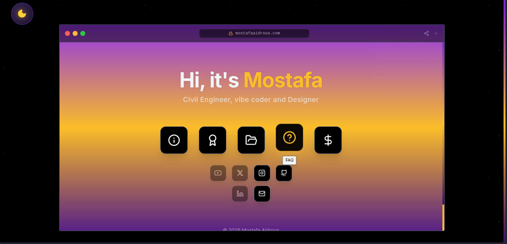

# Mostafa Aidrous

A modern, immersive personal portfolio website showcasing my professional profile, projects, and achievements.



## Features

- **Cinematic Intro Animation** — Custom loading screen with animated progress ring
- **Immersive Starfield Background** — Multi-layer parallax starfield with nebula effects
- **Glass-morphism Design** — Frosted glass panels with enhanced transparency
- **Dark/Light Theme Toggle** — Smooth theme transitions
- **Interactive Content Panels** — Smooth animations with Framer Motion

## Screenshots

| Intro Animation | Main View |
|---------------|-----------|
|  |  |

## Categories

### About
A brief introduction sharing my passion for Civil Engineering, vibe coding, and Designing. Highlights my multidisciplinary expertise spanning engineering, design, and web technologies.

### Certifications
Showcasing my professional certifications and credentials earned through continuous learning and skill development in various fields.

### Works
A curated collection of my best projects — currently in progress and coming soon!

### FAQ
Common questions about my skills, experience, and work approach answered for quick reference.

### Support
A convenient way for visitors to support my work through PayPal donations.

## Tech Stack

- React + TypeScript
- Vite
- Framer Motion
- Tailwind CSS v4
- Lucide React Icons

## Getting Started

```bash
# Install dependencies
npm install

# Start development server
npm run dev

# Build for production
npm run build
```

## Contact

Feel free to reach out for collaborations or inquiries:

- Email: mostafaaidroustch@gmail.com
- GitHub: [@Mustafa-devx](https://github.com/Mustafa-devx)

---

*Crafted with precision and attention to detail.*
